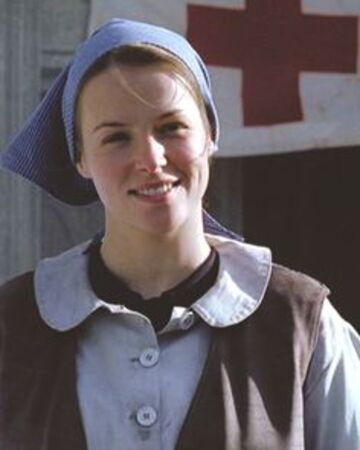

**Anna Freimane** is a Latvian nurse of the International Red Cross. The daughter of the baptist pastor of Aizpute and sister to Gustavs, she spend her childhood years in the village, being Markuss's best friend until her family moved to Riga in the aftermath of the violence of the 1905 Revolution.

After the breakout of war, she volunteers to the Red Cross and soon becomes a skilled nurse, taking care of the wounded soldiers. In 1915, she briefly meets Kris during the health inspection of those that volunteered to the Latvian Riflemen. It was also during that time that she sees the expulsion of the Jews of Kurzeme by the Russian Army, the evacuation of Latvians from Riga and the imprisionment of Baptists Pastors (including her father) to Siberia.

She later reconnects with Markuss after the combats of Death Island in 1916 and they begin a romantic relationship, altought she is troubled by the idea of having to someday see Markuss die, or worse, choose to save another life instead of his'.

In the aftermath of the Christmas Battles in 1917, she is pivotal in protecting Markuss, Kris and Wilks from general Davilov, since he has no jurisdiction to imprison soldiers in a hospital controlled by the Red Cross. But she after the Socialist Revolution she flees with her father to the german controlled area, since her family would be persecuted by the Bolsheviks.

She rescues Markuss after he escapes Riga and accepts to marry him, altought he is left heavily depressed in the aftermath of the Great War and they have a tough year togheter, before she convinces him to help Latvian gain its independence. Later in 1918, she inadvertedly saves the Latvian government when it was betrayed by the Germans.

# Appearance and Character

Anna is a fair, young girl with blonde hair. She is extremely talented and extremely smart, altought she never had any formal higher education. While Anna has a serene disposition and calm voice, she can also sometimes express eccentric beliefs or qualities, sometimes punctuated by humour. She is also keen to sometimes imitate people's words or movement. (Author note: This is a sign of autism and I think it would be very nice to have a character like Anna representing women in the autism spectrum, and I think it would quite fit her character, but I need to work it a little better.)

Anna is very interested in arts, herbology, gardening and christianity and nursing.

# History

[To be added]

