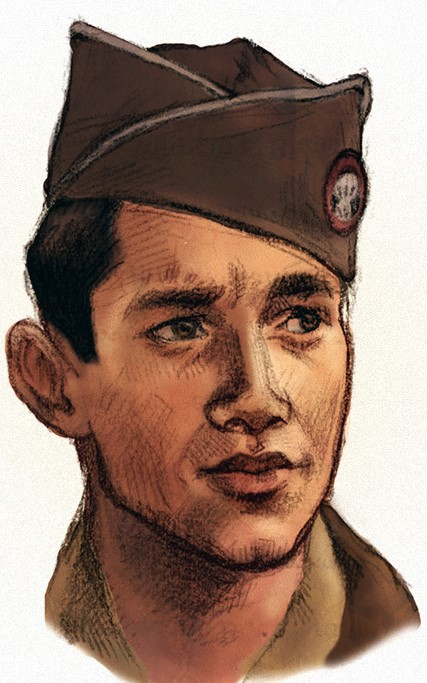

**Gustavs Freiman** is a Latvian soldier part of the 5th Zemgale Regiment and the younger brother of Anna. He joins the Latvian Riflemen after the devastating losses of the battle of Death Island. He is unadvertedly responsible for Markuss finding Anna in 1916 and their romance.

In 1917, he fights in the defense of Riga and after the battle is lost, he helps Markuss escape to german-controlled Courland. In the escape attempt, he is captured by the german forces and presumed to be dead until 1918. He is later released by the germans and joins the newly-formed Latvian government as a courrier/liason officer and also recruits Markuss to the Latvian Armed Forces.

He is present in Jelgava when the German forces betray the Latvian government and is barely captured before escaping to warn the Latvian Army. Unfortunately for him, he is capture by the Soviet forces before and is to be tortured until Wilks recognizes him and releases him.

He takes part in the major events during the Latvian war of independence.

# Appearance and Character

[To be added]

# History

[To be added]

