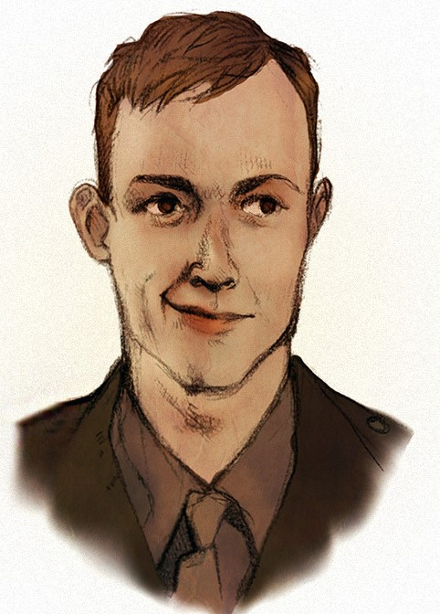

Private **Kristoffs Keidann** is a Latvian soldier of the 3rd Courland Battalion (and later, Regiment). The younger brother of Markuss Keidann, Kristoffs run from home in April 1914 after being prohibited to join the Riga Symphonic Orchestra by his father and brother. He lost communication with his family when the war started.

He volunteers to join Latvian Riflemen in 1915, but being the youngest in his company, he was often lightly mocked by his fellow soldiers. In autumn 1915, he leaves his post in an heroic but foolish attempt to warn units south of his position that they will be annihilated if they do not retreat immediatly (it is later revealed he did that because he thought his brother Markuss could be amongst them)

Finding Kris becomes Markuss's main objective during the first half of the first book, but when he is later found in Death Island, he refuses to leave the army - regarding his duty as a soldier to his fellow brothers in arms. He is injured by mustard gas in Death Island and almost dies before being rescued by Markuss.

Back in Riga, he is accused by Russian Officers (and specially, general Davilov) of cowardice before the enemy and being a spy for german forces, with the help of Markuss, he escapes prison - but instead of saving himself he rushes to the frontline to stop the attack on the Christmas Battles, as Wilks and the Latvian Riflemen will die since the Russians have decided to leave the Latvian to die. He manages to save the Riflemen but dies by his wounds. 

# Appearance and Character

Kris, like his brother, is an "golden haired" Keidann, but with a slim face and expressive eyes he inherited from his mother. He is less stocky than almost all of his fellow soldiers. Kris is at the same time very intelligent but also unaware of his social _faus-passes_. He likes to comments historical or cultural facts - mostly with a good humour - which often falls in deaf ears of his unwitting trench comrades. He speaks thing in a very fast but also dead-pan way, which is often received with laughter from his friends.

A skilled musician and violinist, Kriss usually writes songs or poems about his experience. He rarely shows any of his writings to his friends, with the exception of a baudy poem he wrote to mock his friend's battle injury. Even from a very young age, Kris has always showed an exceptional talent of understanding people and situations, and he has a very good technical knowledge on an increasing amount of skills - which is often contrasted by his inability to put it into practice.

Kris is not personally a skilled soldier and often does not put himself in harm's way, but during the course of the book he changes from trying to prove himself to his brother and father to making real decisions to save his fellow soldiers, even tought it may cost his life.

# History

[To be completed]