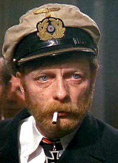

**Captain Milgrave** is a Latvian commanding officer of the 2nd Riga Battalion (and later, Regiment). An old experienced commander, he fought in the Russo-Japanese war before being assigned to the Latvian Land Defense units. He first appears in the story during the defense of Jelgava and later reappears in the Death Island and during the aftermath of the Socialist Revolution. His fate is unknown.

# Appearance and Character

He is often refered by the soldiers of the 3rd Courland Regiment as an _"drunker, smoker, absolutely smashed older version of Wilks"._ He has a palid sick skin, with a somewhat auburn hair and reddish, unkempt beard. He often is seem smoking and appears to be drunk most of the time (altough people ever see him drinking).

He often remarks things with dry irony. Despiste this, he is a competent commander, and is pivotal to the survival of the 2nd Regiment during the attack on Death Island.

# History

[To be added]

